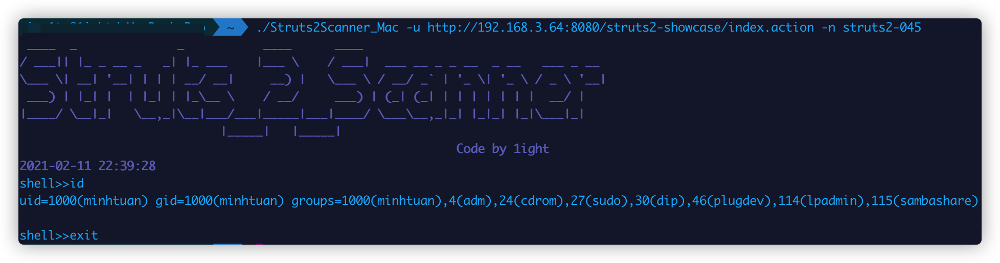
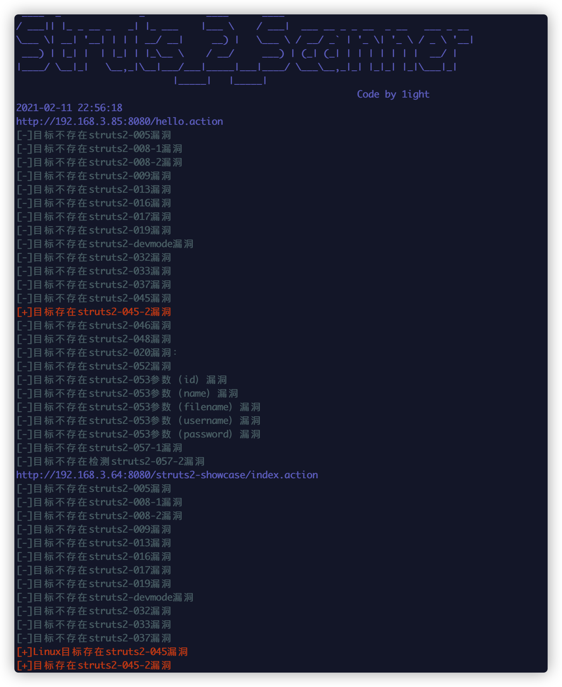

# README
## Struts2Scanner
可快速检测struts2漏洞，也可以批量检测。还可以对已检测出漏洞的网站执行shell命令

## 支持多版本检测
**struts2-005**
**struts2-008**
**struts2-009**
**struts2-013**
**struts2-016**
**struts2-019**
**struts2-devmode**
**struts2-032**
**struts2-033**
**struts2-037**
**struts2-048**
**struts2-052**
**struts2-053**
**struts2-057**

## 参数设置
```bash
-f		导入.txt文件批量检测
-n 	漏洞名称（执行shell）
-u 	测试目标URL
```

## 使用方法







**检测网站是否存在Struts2漏洞**
```bash
./Struts2Scanner_Mac -u http://192.168.3.64:8080/struts2-showcase/index.action
```

**利用漏洞执行shell**
```bash
./Struts2Scanner_Mac -u http://192.168.3.64:8080/struts2-showcase/index.action -n struts2-045
```

**批量检测漏洞**
```bash
./Struts2Scanner_Mac -f url.txt
```